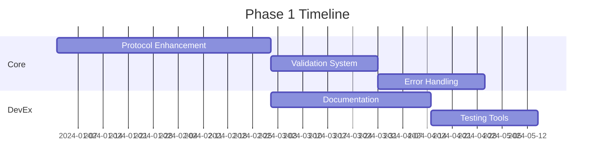
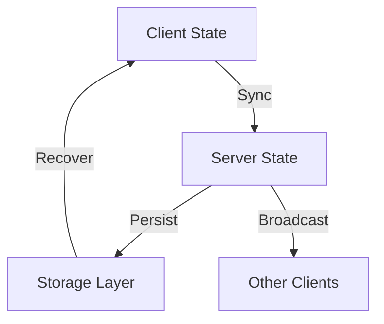
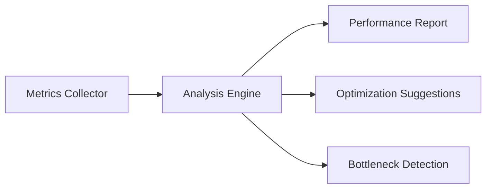
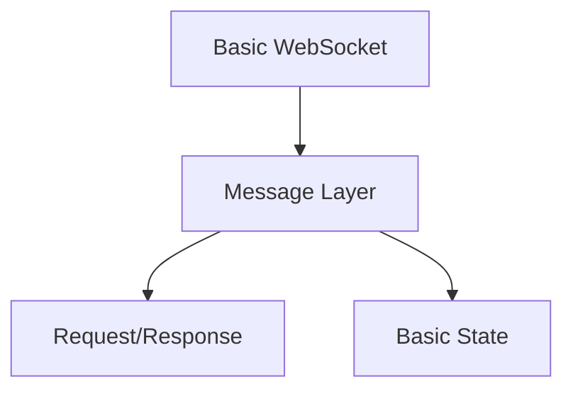
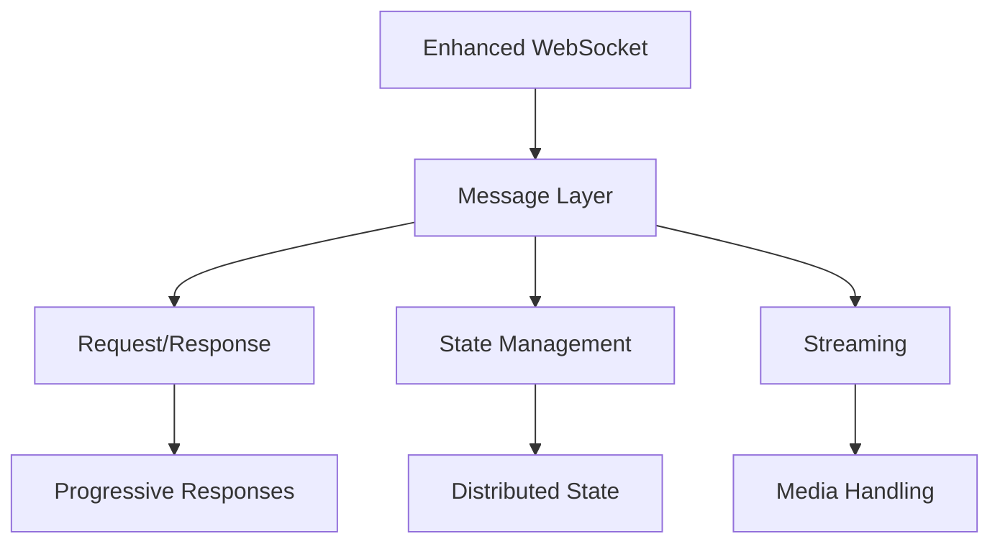

# Helios-Starling Evolution
*Building the Next Generation of Real-Time Communication*

> "Simplicity is the ultimate sophistication" - Leonardo da Vinci

---

## 🎯 Vision & Goals

### Core Vision
To create the most developer-friendly real-time communication protocol, making bidirectional request-response patterns as natural as HTTP calls while maintaining the power of WebSocket.

### Strategic Goals
1. **Simplicity**: Keep the learning curve minimal
2. **Power**: Provide advanced features when needed
3. **Reliability**: Ensure robust communication
4. **Developer Experience**: Make debugging and development a joy
5. **Performance**: Stay lightweight and efficient

---

## 📈 Evolution Phases

### Phase 1: Foundation (Q1-Q2 2024)
*Building the core infrastructure and establishing the ecosystem*

#### Core Protocol Enhancement
- [ ] Advanced message validation
- [ ] Improved error handling patterns
- [ ] Extended metadata support
- [ ] Enhanced type safety

#### Developer Experience
- [ ] Interactive documentation
- [ ] Protocol playground
- [ ] Debug logging utilities
- [ ] Testing toolkit



### Phase 2: Advanced Features (Q3-Q4 2024)
*Extending capabilities while maintaining simplicity*

#### Enhanced Messaging
```typescript
// Progressive Response Example
client.request("heavyComputation", data)
  .onProgress((progress) => {
    console.log(`Progress: ${progress.percentage}%`);
    console.log(`Stage: ${progress.stage}`);
  })
  .onComplete((result) => {
    console.log(`Final result: ${result}`);
  });
```

#### Smart State Management


#### Key Features
1. **Progressive Responses**
   - Streaming support
   - Progress tracking
   - Partial results
   - Pause/Resume capability

2. **Advanced State Management**
   - Transaction support
   - Atomic operations
   - State versioning
   - Conflict resolution

3. **Enhanced Security**
   - End-to-end encryption
   - Advanced auth patterns
   - Permission system
   - Audit logging

### Phase 3: Ecosystem (2025)
*Building a rich ecosystem of tools and integrations*

#### Developer Tools
##### Protocol Inspector
```javascript
// Development middleware
helios.use(inspector({
  ui: true,           // Enable web UI
  metrics: true,      // Collect performance metrics
  storage: true,      // Save message history
  replay: true        // Enable message replay
}));
```

##### Testing Framework
```javascript
// Testing utilities
describe('User Service', () => {
  it('should handle concurrent requests', async () => {
    await heliosTest.scenario('concurrent-requests')
      .client(3)                // Spin up 3 clients
      .execute(async (client) => {
        await client.request('user:update', data);
      })
      .assertOrderedExecution()
      .assertNoErrors();
  });
});
```

#### Cross-Language Support
- Official Language Support:
  - [ ] Python Client/Server
  - [ ] Rust Server
  - [ ] Go Client/Server
  - [ ] C# Client
  - [ ] Java Client

#### Performance Tools


---

## 🛠 Technical Evolution

### Current Architecture


### Target Architecture


---

## 🎯 Key Metrics & Goals

| Metric | Current | 2024 Goal | 2025 Goal |
|--------|---------|-----------|-----------|
| Latency (99th percentile) | <100ms | <50ms | <25ms |
| Memory per connection | ~50KB | ~30KB | ~20KB |
| Concurrent connections | 10k | 50k | 100k |
| Message throughput | 10k/s | 50k/s | 100k/s |
| Developer satisfaction | N/A | 4/5 | 4.5/5 |

---

## 🔍 Focus Areas

### Performance
- Message batching
- Binary protocols
- Zero-copy processing
- Memory optimization

### Reliability
- Enhanced error recovery
- Circuit breakers
- Load shedding
- Health metrics

### Developer Experience
- Live debugging
- Message tracing
- Performance profiling
- Error prediction

---

## 🛣️ Implementation Timeline

### Q1 2024
- Core protocol stabilization
- Documentation enhancement
- Basic developer tools
- Performance baseline

### Q2 2024
- Progressive responses
- Enhanced state management
- Security improvements
- Testing framework

### Q3 2024
- Advanced streaming
- Cross-language support
- Performance optimization
- Extended tooling

### Q4 2024
- Ecosystem development
- Community tools
- Enterprise features
- Performance tuning

### 2025
- Advanced use cases
- Industry-specific solutions
- Platform maturity
- Ecosystem growth

---

## 🤝 Community Growth

### Documentation
- Interactive tutorials
- Video courses
- Best practices
- Pattern library

### Tools
- Protocol inspector
- Performance analyzer
- State visualizer
- Test generators

### Support
- Community forum
- Office hours
- Expert network
- Training program

---

## 📊 Success Criteria

### Technical Excellence
- [ ] Zero-downtime upgrades
- [ ] <1s connection recovery
- [ ] <50ms message latency
- [ ] 99.99% uptime

### Developer Satisfaction
- [ ] <30min to first working app
- [ ] >90% documentation coverage
- [ ] <5min to identify issues
- [ ] >4/5 developer satisfaction

### Ecosystem Health
- [ ] >5 language implementations
- [ ] >100 community plugins
- [ ] >1000 GitHub stars
- [ ] >10k weekly downloads

---

*This roadmap is a living document and will evolve based on community feedback and technological advances.*

###### Last updated: January 8, 2024