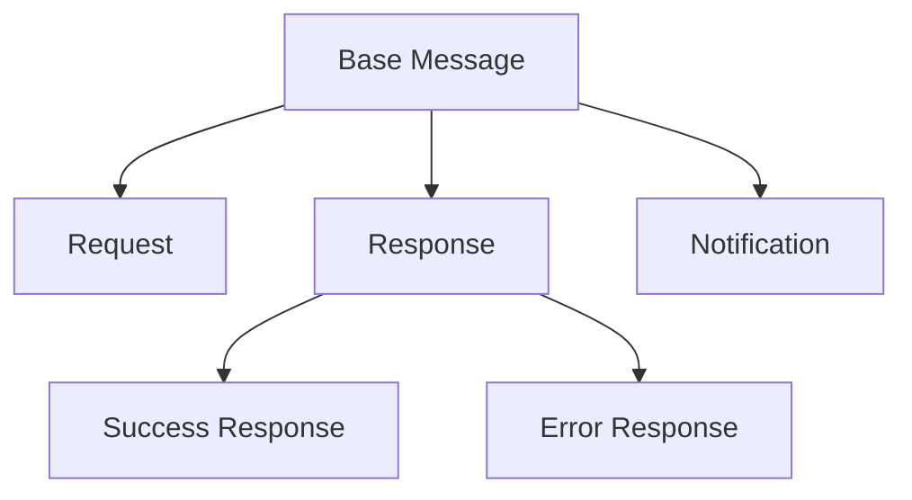

# Message Format Specification
**Version:** 1.0.0  
**Status:** Draft  
**Last Updated:** 2024-01-08

## 1. Overview

This document provides detailed schemas and validation rules for all message types in the Helios-Starling protocol. All messages exchanged between clients and servers MUST conform to these specifications.

## 2. Message Type Hierarchy



## 3. Schema Definitions

### 3.1. Base Message

Every message MUST include these base fields:

```json
{
  "protocol": {
    "type": "string",
    "enum": ["helios-starling"],
    "required": true
  },
  "version": {
    "type": "string",
    "pattern": "^\\d+\\.\\d+\\.\\d+$",
    "required": true
  },
  "timestamp": {
    "type": "number",
    "integer": true,
    "minimum": 0,
    "required": true
  },
  "type": {
    "type": "string",
    "enum": ["request", "response", "notification"],
    "required": true
  }
}
```

### 3.2. Request Message

Extends Base Message with:

```json
{
  "type": {
    "type": "string",
    "enum": ["request"],
    "required": true
  },
  "requestId": {
    "type": "string",
    "format": "uuid",
    "required": true
  },
  "method": {
    "type": "string",
    "pattern": "^[a-zA-Z][a-zA-Z0-9_]*(:[a-zA-Z][a-zA-Z0-9_]*)*$",
    "minLength": 3,
    "required": true
  },
  "payload": {
    "type": "any",
    "required": false
  }
}
```

#### Method Name Rules:
- MUST start with a letter
- MUST contain only letters, numbers, underscores, and colons
- MUST be at least 3 characters long
- SHOULD follow namespace:action format
- MAY include multiple namespace levels (e.g., `namespace:subspace:action`)

### 3.3. Response Message

Extends Base Message with either Success or Error format:

#### 3.3.1. Success Response

```json
{
  "type": {
    "type": "string",
    "enum": ["response"],
    "required": true
  },
  "requestId": {
    "type": "string",
    "format": "uuid",
    "required": true
  },
  "success": {
    "type": "boolean",
    "enum": [true],
    "required": true
  },
  "data": {
    "type": "any",
    "required": false
  }
}
```

#### 3.3.2. Error Response

```json
{
  "type": {
    "type": "string",
    "enum": ["response"],
    "required": true
  },
  "requestId": {
    "type": "string",
    "format": "uuid",
    "required": true
  },
  "success": {
    "type": "boolean",
    "enum": [false],
    "required": true
  },
  "error": {
    "type": "object",
    "required": true,
    "properties": {
      "code": {
        "type": "string",
        "required": true
      },
      "message": {
        "type": "string",
        "required": true
      },
      "details": {
        "type": "any",
        "required": false
      }
    }
  }
}
```

### 3.4. Notification Message

Extends Base Message with:

```json
{
  "type": {
    "type": "string",
    "enum": ["notification"],
    "required": true
  },
  "notification": {
    "type": "object",
    "required": true,
    "properties": {
      "topic": {
        "type": "string",
        "pattern": "^[a-zA-Z][a-zA-Z0-9_]*(:[a-zA-Z][a-zA-Z0-9_]*)*$",
        "required": false
      },
      "data": {
        "type": "any",
        "required": true
      }
    }
  }
}
```

## 4. Validation Rules

### 4.1. Common Rules

1. All timestamps MUST be in milliseconds since Unix epoch
2. All UUIDs MUST be v4
3. Protocol version MUST follow semantic versioning
4. All string fields MUST be UTF-8 encoded

### 4.2. Size Limits

1. Method names: Maximum 128 characters
2. Error messages: Maximum 1024 characters
3. Total message size: Implementation-defined (RECOMMENDED: 1MB)

### 4.3. Payload Validation

1. `payload` and `data` fields MAY contain any valid JSON value
2. Binary data SHOULD be base64 encoded
3. Circular references are NOT allowed
4. `null` is a valid value for optional fields

## 5. Examples

### 5.1. Valid Request

```json
{
  "protocol": "helios-starling",
  "version": "1.0.0",
  "timestamp": 1704672000000,
  "type": "request",
  "requestId": "550e8400-e29b-41d4-a716-446655440000",
  "method": "users:getProfile",
  "payload": {
    "userId": "123"
  }
}
```

### 5.2. Valid Success Response

```json
{
  "protocol": "helios-starling",
  "version": "1.0.0",
  "timestamp": 1704672000100,
  "type": "response",
  "requestId": "550e8400-e29b-41d4-a716-446655440000",
  "success": true,
  "data": {
    "profile": {
      "id": "123",
      "name": "John Doe"
    }
  }
}
```

### 5.3. Valid Error Response

```json
{
  "protocol": "helios-starling",
  "version": "1.0.0",
  "timestamp": 1704672000100,
  "type": "response",
  "requestId": "550e8400-e29b-41d4-a716-446655440000",
  "success": false,
  "error": {
    "code": "USER_NOT_FOUND",
    "message": "User with id 123 not found"
  }
}
```

### 5.4. Valid Notification

```json
{
  "protocol": "helios-starling",
  "version": "1.0.0",
  "timestamp": 1704672000000,
  "type": "notification",
  "notification": {
    "topic": "users:presence",
    "data": {
      "userId": "123",
      "status": "online"
    }
  }
}
```

## 6. Common Validation Errors

| Error Case | Error Code |
|------------|------------|
| Missing required field | `INVALID_MESSAGE_FORMAT` |
| Invalid UUID format | `INVALID_REQUEST_ID` |
| Invalid method name | `INVALID_METHOD_NAME` |
| Message too large | `MESSAGE_TOO_LARGE` |
| Invalid version format | `INVALID_VERSION` |

## 7. Implementation Notes

### 7.1. Message Validation

Implementations SHOULD:
1. Validate messages as early as possible in the processing pipeline
2. Fail fast on validation errors
3. Provide detailed error messages during development
4. Consider implementing message sanitization

### 7.2. Performance Considerations

1. Consider implementing message schema caching
2. Use streaming parsers for large messages
3. Implement size checks before full parsing
4. Consider binary message format for performance-critical applications

---

## Appendix A: Changes

### Version 1.0.0
- Initial message format specification