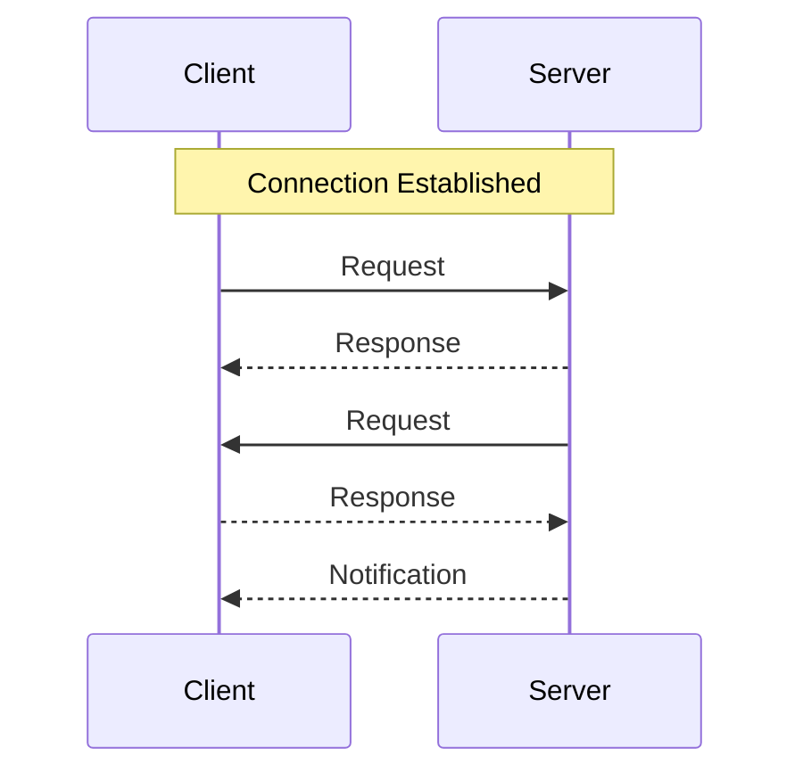

# Helios-Starling Core Protocol Specification
**Version:** 1.0.0  
**Status:** Draft  
**Last Updated:** 2024-01-08

## Abstract

This document specifies the Helios-Starling protocol, a WebSocket-based protocol designed for bidirectional request/response communication patterns. The protocol provides a structured way to handle request/response flows in both directions (client-to-server and server-to-client) while maintaining simplicity and developer experience.

## 1. Introduction

### 1.1. Purpose

The Helios-Starling protocol aims to provide a standardized way of implementing bidirectional request/response patterns over WebSocket connections. While WebSocket provides raw bidirectional communication, this protocol adds structure, reliability, and developer-friendly patterns on top.

### 1.2. Terminology

The key words "MUST", "MUST NOT", "REQUIRED", "SHALL", "SHALL NOT", "SHOULD", "SHOULD NOT", "RECOMMENDED", "MAY", and "OPTIONAL" in this document are to be interpreted as described in RFC 2119.

- **Helios** - The server implementation of the protocol
- **Starling** - A client connected to a Helios server
- **Method** - A named handler for requests
- **Request** - A message requesting the execution of a method
- **Response** - A message containing the result of a method execution
- **Notification** - A one-way message not expecting a response

## 2. Protocol Overview

### 2.1. Connection Establishment

1. The client initiates a WebSocket connection to the server
2. If the client has a recovery token:
   - It MUST be included as a URL parameter named `recover`
   - The server SHOULD attempt to restore the previous state
3. Once the WebSocket connection is established, either party MAY send messages

### 2.2. Message Flow



### 2.3. Message Types

The protocol defines three primary message types:

1. Request messages (requiring a response)
2. Response messages (answering a request)
3. Notification messages (one-way, no response expected)

## 3. Message Format

### 3.1. Base Message Structure

All messages MUST be valid JSON and MUST include these base fields:

```typescript
{
  "protocol": "helios-starling",    // Protocol identifier
  "version": string,                // Semver format
  "timestamp": number,              // Unix timestamp in milliseconds
  "type": "request"|"response"|"notification"
}
```

### 3.2. Request Messages

```typescript
{
  ...BaseMessage,
  "type": "request",
  "requestId": string,              // UUID v4
  "method": string,                 // Format: "namespace:action"
  "payload": any                    // Optional
}
```

### 3.3. Response Messages

```typescript
{
  ...BaseMessage,
  "type": "response",
  "requestId": string,              // Matching request UUID
  "success": boolean,
  "data": any,                      // Present if success is true
  "error": {                        // Present if success is false
    "code": string,
    "message": string
  }
}
```

### 3.4. Notification Messages

```typescript
{
  ...BaseMessage,
  "type": "notification",
  "notification": {
    "topic": string,                // Optional, for routing
    "data": any
  }
}
```

## 4. Method Names

### 4.1. Format

Method names MUST:
- Start with a letter
- Contain only letters, numbers, underscores, and colons
- Be at least 3 characters long
- Follow the format `namespace:action`

### 4.2. Reserved Namespaces

The following namespaces are reserved and MUST NOT be used by custom methods:
- `system`
- `internal`
- `stream`
- `helios`

## 5. State and Recovery

### 5.1. Recovery Token

Servers SHOULD provide a method for clients to obtain a recovery token:

```typescript
// Request
method: "starling:getToken"
payload: {}

// Response
{
  "token": string,      // JWT token
  "expiresIn": number   // Seconds until expiration
}
```

### 5.2. Token Structure

Recovery tokens MUST be JWTs containing at least:
```typescript
{
  "starlingId": string,    // Unique client identifier
  "timestamp": number,     // Token creation time
  "state": object         // Client state to recover
}
```

### 5.3. Reconnection Process

1. Client disconnects (intentionally or not)
2. Server maintains client state for a configurable period (default: 5 minutes)
3. Client reconnects with token
4. Server restores state if valid
5. Normal operation resumes

## 6. Error Handling

### 6.1. Standard Error Codes

Servers MUST implement these standard error codes:

| Code | Description |
|------|-------------|
| `INVALID_MESSAGE_FORMAT` | Message does not conform to protocol |
| `METHOD_NOT_FOUND` | Requested method does not exist |
| `METHOD_ERROR` | Error during method execution |
| `REQUEST_TIMEOUT` | Request exceeded timeout |
| `REQUEST_CANCELLED` | Request was cancelled |

### 6.2. Error Response Format

```typescript
{
  "success": false,
  "error": {
    "code": string,     // Standard or custom error code
    "message": string   // Human-readable description
  }
}
```

## 7. Security Considerations

### 7.1. Transport Security

- All production deployments MUST use WSS (WebSocket Secure)
- Recovery tokens MUST be signed with a secure algorithm (minimum HS256)
- Servers SHOULD implement rate limiting

### 7.2. Method Security

- Servers MUST validate all incoming messages against the protocol schema
- Servers MUST validate method permissions before execution
- Methods SHOULD have timeouts to prevent resource exhaustion

## 8. Conformance

### 8.1. Server Requirements

A conforming server implementation MUST:
1. Accept WebSocket connections
2. Handle all message types correctly
3. Validate messages against the protocol schema
4. Implement the standard error codes
5. Support the recovery token system

### 8.2. Client Requirements

A conforming client implementation MUST:
1. Establish WebSocket connections correctly
2. Send properly formatted messages
3. Handle all message types correctly
4. Respect the method naming conventions
5. Support the recovery token system

## 9. References

1. RFC 2119 - Key words for use in RFCs
2. RFC 6455 - The WebSocket Protocol
3. RFC 7519 - JSON Web Token (JWT)

---

## Appendix A: Changes

### Version 1.0.0
- Initial protocol specification